# 🏗️ System Architecture Documentation
## QR-Based Proxy-Free Attendance System

**Version:** 1.0.0  
**Last Updated:** 2026  
**Document Type:** Technical Architecture

---

## Table of Contents

1. [Architecture Overview](#architecture-overview)
2. [System Architecture](#system-architecture)
3. [Layered Architecture](#layered-architecture)
4. [Component Diagrams](#component-diagrams)
5. [Data Flow Diagrams](#data-flow-diagrams)
6. [Sequence Diagrams](#sequence-diagrams)
7. [Deployment Architecture](#deployment-architecture)
8. [Technology Stack](#technology-stack)
9. [Design Patterns](#design-patterns)
10. [Security Architecture](#security-architecture)

---

## 1. Architecture Overview

### 1.1 Architecture Style

**Type:** Monolithic REST-based Web Application

**Rationale:**
- Fast development and deployment
- Easy debugging and maintenance
- Simple academic explanation
- Clean upgrade path for FYP
- Suitable for MVP requirements

### 1.2 Architecture Principles

1. **Separation of Concerns:** Clear boundaries between layers
2. **Stateless Design:** Server-side state management only
3. **RESTful API:** Standard HTTP methods and status codes
4. **Layered Architecture:** Presentation → Controller → Service → Data
5. **Single Responsibility:** Each component has one clear purpose
6. **DRY Principle:** Don't Repeat Yourself
7. **KISS Principle:** Keep It Simple, Stupid

---

## 2. System Architecture

### 2.1 High-Level Architecture

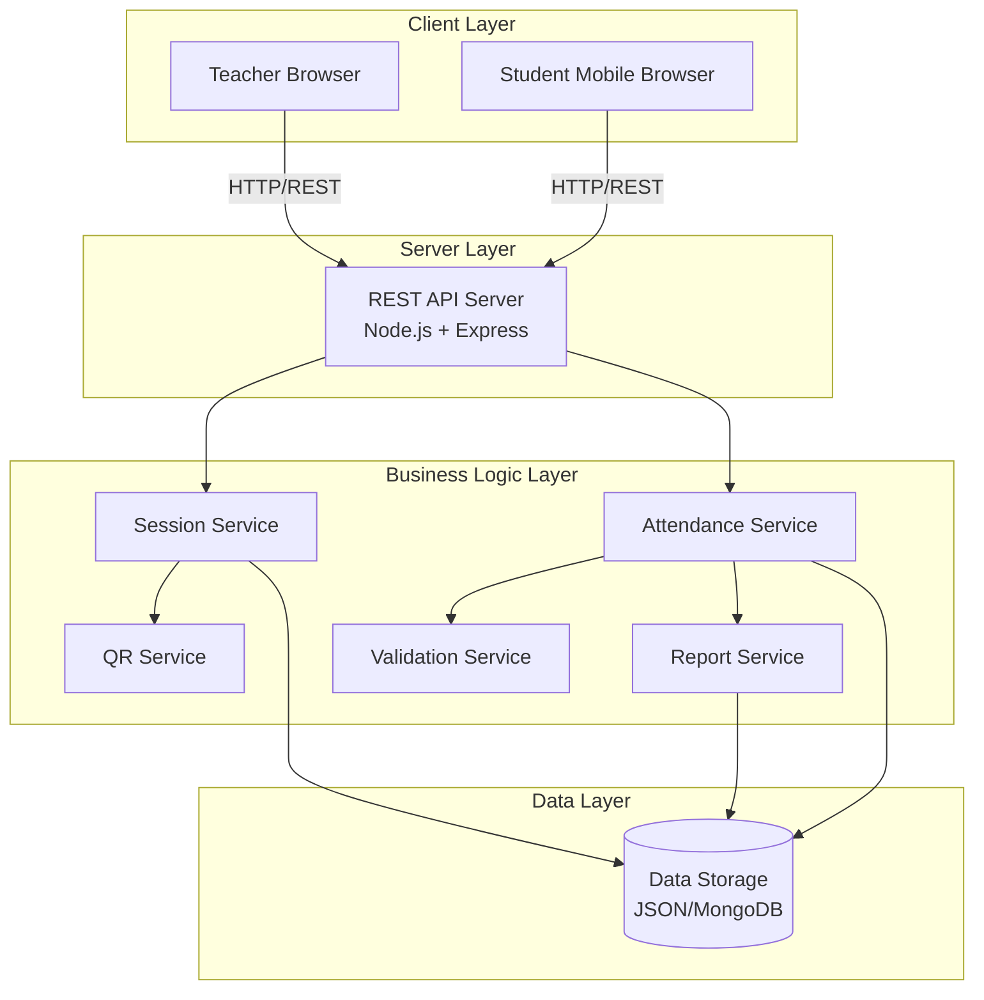

### 2.2 System Components

| Component | Responsibility | Technology |
|-----------|---------------|------------|
| Teacher Interface | Session management UI | HTML5, CSS3, JavaScript |
| Student Interface | QR scanning and submission | HTML5, CSS3, JavaScript |
| REST API Server | HTTP request handling | Node.js, Express.js |
| Session Service | Session lifecycle management | Node.js |
| Attendance Service | Attendance recording logic | Node.js |
| QR Service | QR code generation | qrcode library |
| Validation Service | Input and business rule validation | Node.js |
| Report Service | CSV/PDF generation | csv-writer, pdfkit |
| Data Storage | Persistent data storage | JSON files / MongoDB |

---

## 3. Layered Architecture

### 3.1 Layer Structure

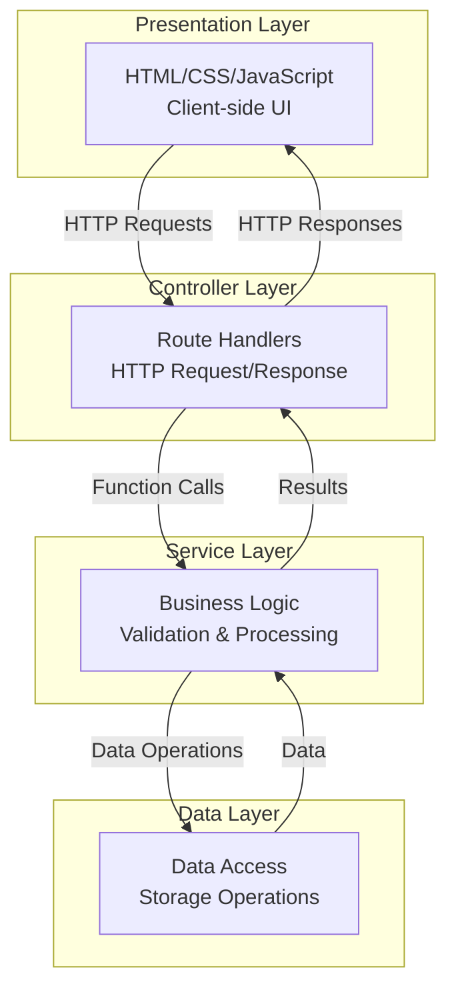

### 3.2 Layer Responsibilities

#### Presentation Layer
- **Purpose:** User interface rendering and interaction
- **Components:**
  - Teacher dashboard (HTML/CSS/JS)
  - Student scanning interface (HTML/CSS/JS)
- **Responsibilities:**
  - Display QR codes
  - Capture user input
  - Handle form submissions
  - Display feedback messages
  - Real-time updates

#### Controller Layer
- **Purpose:** HTTP request handling and routing
- **Components:**
  - `session.routes.js`
  - `attendance.routes.js`
- **Responsibilities:**
  - Route HTTP requests to appropriate handlers
  - Extract request parameters
  - Call service layer methods
  - Format HTTP responses
  - Handle errors and status codes

#### Service Layer
- **Purpose:** Business logic and validation
- **Components:**
  - `session.service.js`
  - `attendance.service.js`
  - `qr.service.js`
  - `validation.service.js`
  - `report.service.js`
- **Responsibilities:**
  - Implement business rules
  - Validate inputs
  - Process data
  - Generate QR codes
  - Create reports
  - Coordinate between services

#### Data Layer
- **Purpose:** Data persistence and retrieval
- **Components:**
  - `session.model.js`
  - `attendance.model.js`
  - Data storage (JSON/MongoDB)
- **Responsibilities:**
  - CRUD operations
  - Data serialization
  - File I/O operations
  - Database queries
  - Data integrity

### 3.3 Layer Interaction Rules

**Rules:**
1. ✅ Presentation can only call Controller via HTTP
2. ✅ Controller can only call Service layer
3. ✅ Service can call Data layer and other Services
4. ✅ Data layer only handles storage operations
5. ❌ No direct Presentation → Service calls
6. ❌ No direct Controller → Data calls
7. ❌ No direct Service → Controller calls

---

## 4. Component Diagrams

### 4.1 Session Management Component

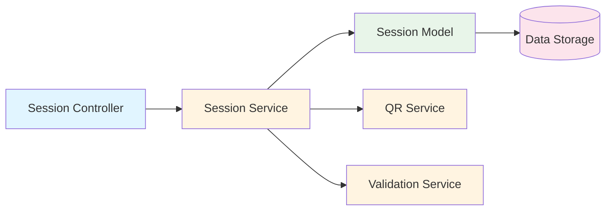

**Component Interactions:**
- Controller receives HTTP request
- Service validates input and business rules
- Service generates QR code via QR Service
- Model persists session data
- Service returns session details to Controller

### 4.2 Attendance Recording Component

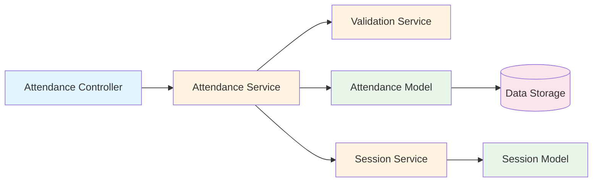

**Component Interactions:**
- Controller receives attendance submission
- Service validates session (via Session Service)
- Service validates roll number and checks duplicates
- Model persists attendance record
- Service returns success/failure to Controller

### 4.3 Report Generation Component

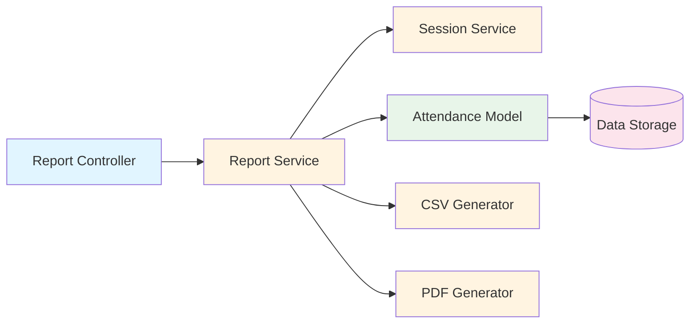

**Component Interactions:**
- Controller receives report request
- Service retrieves session data
- Service retrieves attendance records
- Service generates CSV/PDF files
- Controller returns file download

---

## 5. Data Flow Diagrams

### 5.1 Start Attendance Session Flow

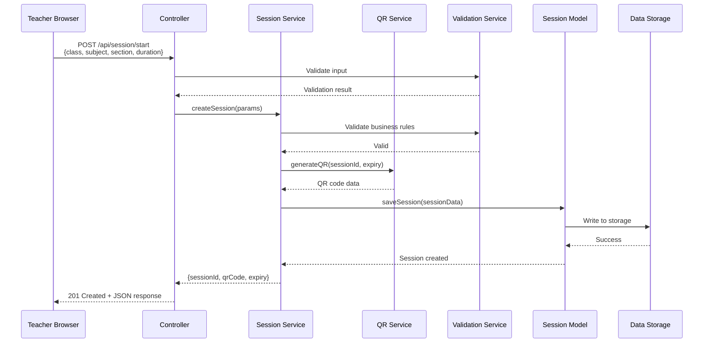

### 5.2 Mark Attendance Flow

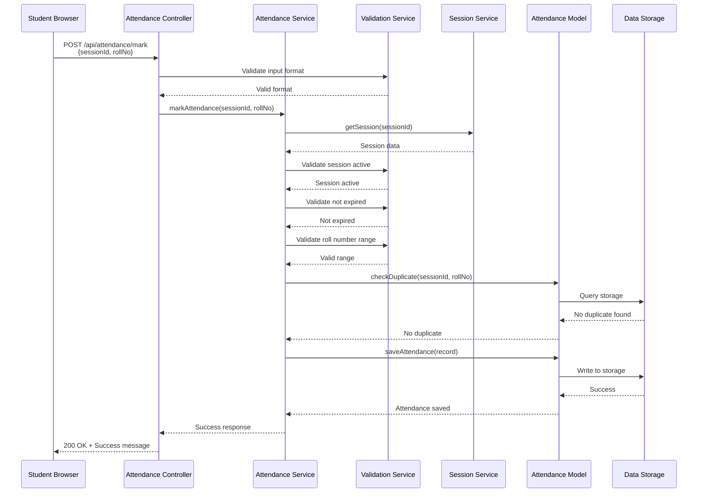

### 5.3 End Session Flow

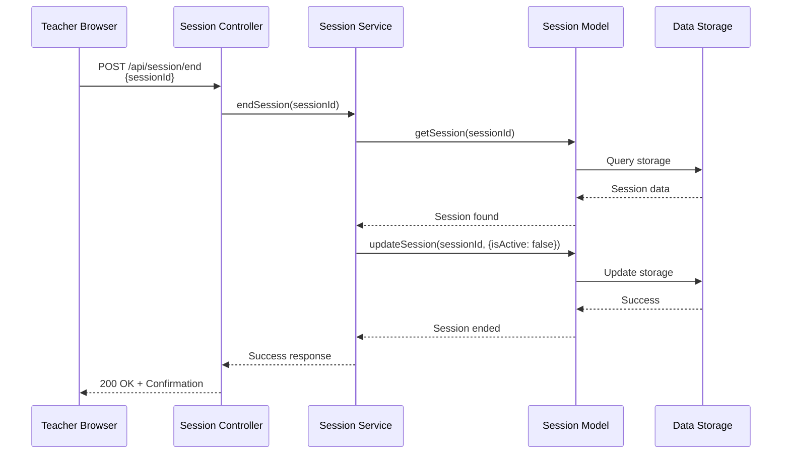

### 5.4 Generate Report Flow

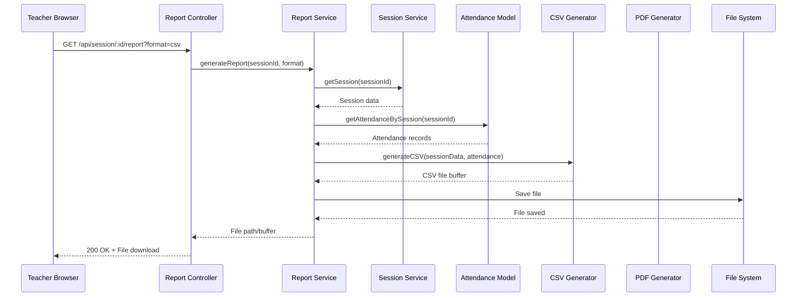

---

## 6. Sequence Diagrams

### 6.1 Complete Attendance Session Lifecycle

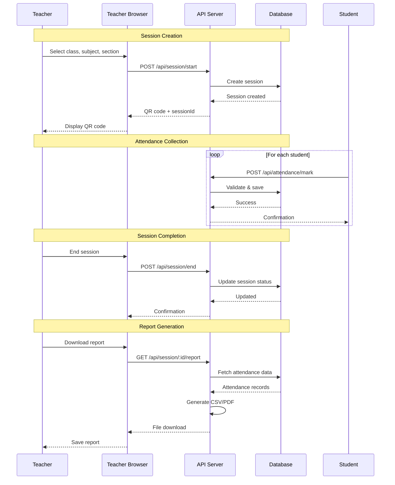

### 6.2 Error Handling Flow

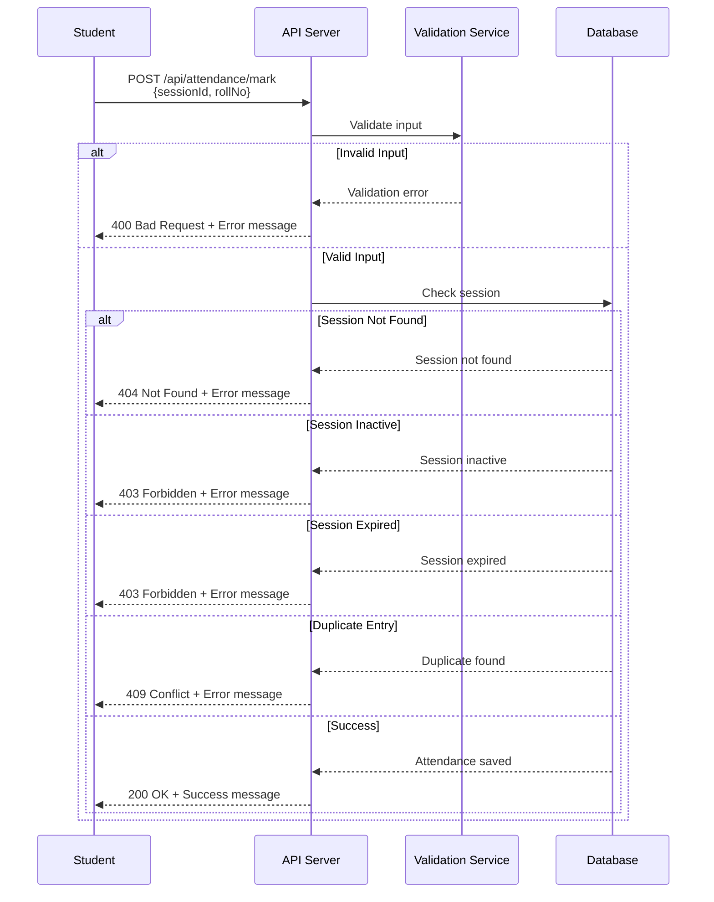

---

## 7. Deployment Architecture

### 7.1 MVP Deployment (Development)

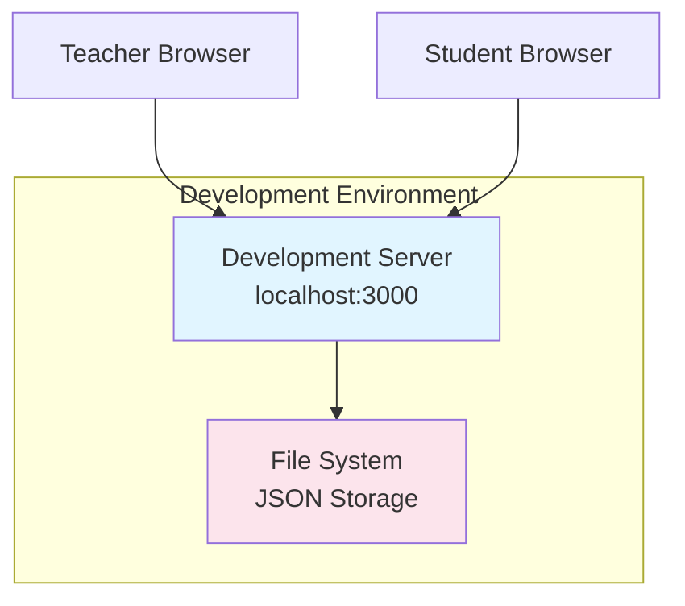

**Components:**
- Single Node.js server
- JSON file storage
- Local development environment
- No load balancing
- No database server

### 7.2 Production Deployment (Future)

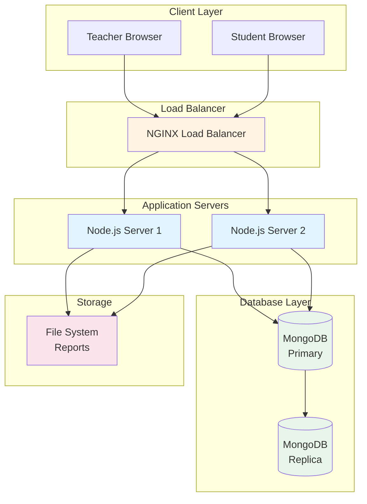

**Components:**
- Load balancer (NGINX)
- Multiple application servers
- MongoDB database cluster
- File storage for reports
- Monitoring and logging

---

## 8. Technology Stack

### 8.1 Frontend Technologies

| Technology | Version | Purpose |
|-----------|---------|---------|
| HTML5 | Latest | Markup structure |
| CSS3 | Latest | Styling and layout |
| JavaScript (ES6+) | Latest | Client-side logic |
| QR Scanner Library | Latest | QR code scanning |

### 8.2 Backend Technologies

| Technology | Version | Purpose |
|-----------|---------|---------|
| Node.js | 18+ | Runtime environment |
| Express.js | 4.x | Web framework |
| qrcode | Latest | QR code generation |
| csv-writer | Latest | CSV report generation |
| pdfkit | Latest | PDF report generation |
| uuid | Latest | Unique ID generation |

### 8.3 Data Storage

| Technology | Version | Purpose |
|-----------|---------|---------|
| JSON Files | - | MVP data storage |
| MongoDB | 6+ | Production database (future) |
| File System | - | Report storage |

### 8.4 Development Tools

| Tool | Purpose |
|------|---------|
| npm | Package management |
| Git | Version control |
| Postman | API testing |
| VS Code | Code editor |

---

## 9. Design Patterns

### 9.1 Patterns Used

#### 1. MVC (Model-View-Controller)
- **Model:** Data models (`session.model.js`, `attendance.model.js`)
- **View:** HTML templates and client-side JavaScript
- **Controller:** Route handlers (`session.controller.js`, `attendance.controller.js`)

#### 2. Service Layer Pattern
- Business logic separated into service classes
- Controllers delegate to services
- Services handle complex operations

#### 3. Repository Pattern
- Data access abstracted through models
- Models handle all database operations
- Services interact with models, not directly with storage

#### 4. Singleton Pattern
- Service instances created once
- Shared across application
- Efficient resource usage

#### 5. Factory Pattern
- QR code generation factory
- Report generation factory
- Creates objects based on parameters

### 9.2 Pattern Benefits

- **Maintainability:** Clear separation of concerns
- **Testability:** Each layer can be tested independently
- **Scalability:** Easy to add new features
- **Reusability:** Services can be reused across controllers

---

## 10. Security Architecture

### 10.1 Security Layers

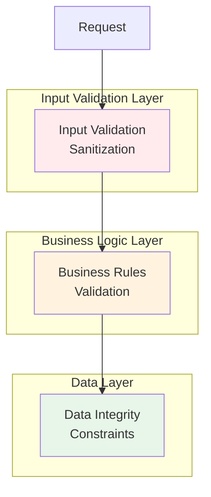

### 10.2 Security Measures

#### Input Validation
- **Server-side validation:** All inputs validated on server
- **Type checking:** Ensure correct data types
- **Range validation:** Roll numbers within allowed range
- **Sanitization:** Prevent injection attacks

#### Session Security
- **Time-limited sessions:** Automatic expiry
- **Unique session IDs:** UUID generation
- **Session state validation:** Check active status
- **Expiry enforcement:** Server-side time checks

#### Data Security
- **Duplicate prevention:** Server-side checks
- **Data integrity:** Validation before storage
- **Error handling:** No sensitive data in errors
- **Logging:** Audit trail for all operations

#### Proxy Prevention
- **Time windows:** Limited attendance window
- **Duplicate blocking:** One entry per roll number
- **Server validation:** All checks server-side
- **Real-time monitoring:** Teacher visibility

### 10.3 Security Best Practices

1. ✅ All validation server-side
2. ✅ No sensitive data in client
3. ✅ Input sanitization
4. ✅ Error messages don't leak information
5. ✅ Session expiry enforcement
6. ✅ Duplicate prevention
7. ✅ Audit logging

---

## 11. Scalability Considerations

### 11.1 Current Architecture (MVP)

- **Single server:** Handles all requests
- **JSON storage:** File-based persistence
- **Synchronous operations:** Sequential processing
- **Capacity:** 150-200 students per session

### 11.2 Future Scalability Path

#### Horizontal Scaling
- Load balancer for multiple servers
- Stateless application design
- Shared database

#### Database Migration
- JSON → MongoDB migration path
- Schema design supports migration
- Data migration scripts

#### Caching Strategy
- Session data caching
- QR code caching
- Report caching

#### Performance Optimization
- Database indexing
- Query optimization
- Connection pooling
- Async operations

---

## 12. Error Handling Architecture

### 12.1 Error Flow

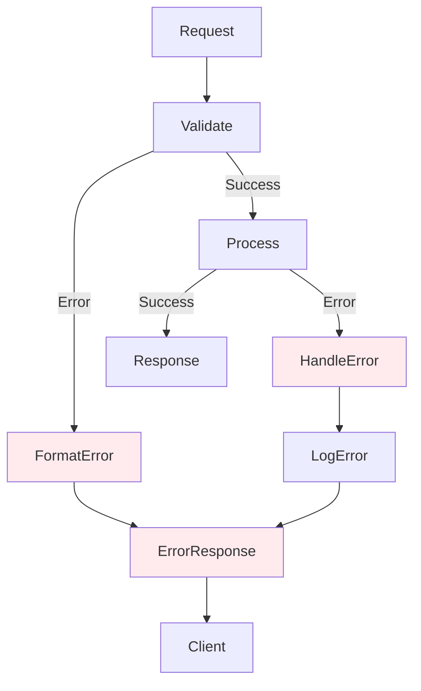

### 12.2 Error Categories

1. **Validation Errors (400):** Invalid input format
2. **Not Found (404):** Session doesn't exist
3. **Forbidden (403):** Session inactive/expired
4. **Conflict (409):** Duplicate entry
5. **Server Error (500):** Internal server errors

### 12.3 Error Handling Strategy

- **Consistent error format:** Standardized error responses
- **Error logging:** All errors logged server-side
- **User-friendly messages:** Clear error messages
- **Graceful degradation:** System continues operating

---

## 13. Monitoring and Logging

### 13.1 Logging Strategy

**Log Levels:**
- **INFO:** Normal operations (session created, attendance marked)
- **WARN:** Potential issues (duplicate attempts, expired sessions)
- **ERROR:** System errors (validation failures, storage errors)

**Log Information:**
- Timestamp
- Request details
- User actions
- System responses
- Error details

### 13.2 Monitoring Points

1. **Session creation rate**
2. **Attendance submission rate**
3. **Error rate**
4. **Response times**
5. **Storage usage**
6. **Concurrent sessions**

---

## 14. Conclusion

This architecture provides a solid foundation for the QR-Based Attendance System, balancing simplicity for MVP requirements with scalability for future growth. The layered approach ensures maintainability, testability, and extensibility.

**Key Strengths:**
- Clear separation of concerns
- Scalable design patterns
- Security-first approach
- Future-ready architecture

**Next Steps:**
1. Review API specifications (see API_DOCUMENTATION.md)
2. Review database schema (see DATABASE_SCHEMA.md)
3. Begin implementation following this architecture

---

## Document Control

| Version | Date | Author | Changes |
|---------|------|--------|---------|
| 1.0.0 | 2026 | Abdul Hakeem Shah | Initial architecture documentation |

---

**Document Status:** ✅ Approved  
**Review Date:** Quarterly  
**Distribution:** Development Team, Technical Leads

