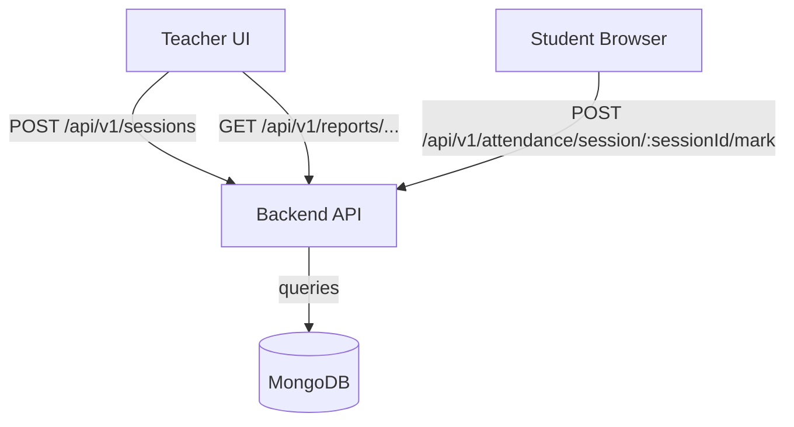
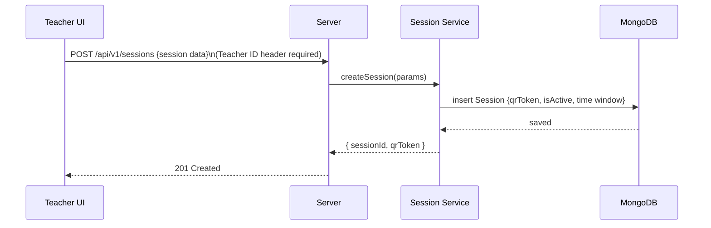
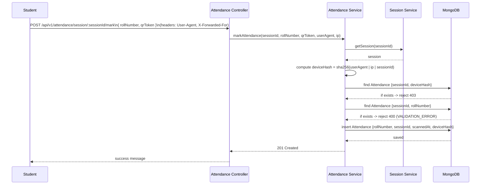
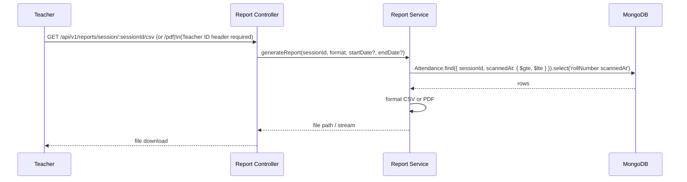
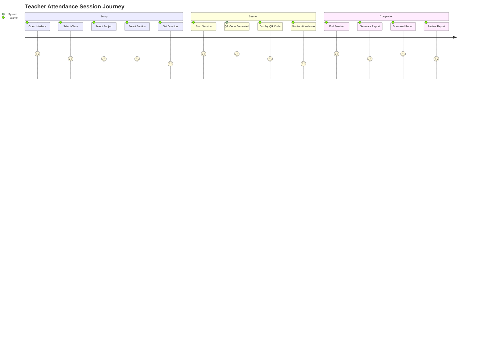
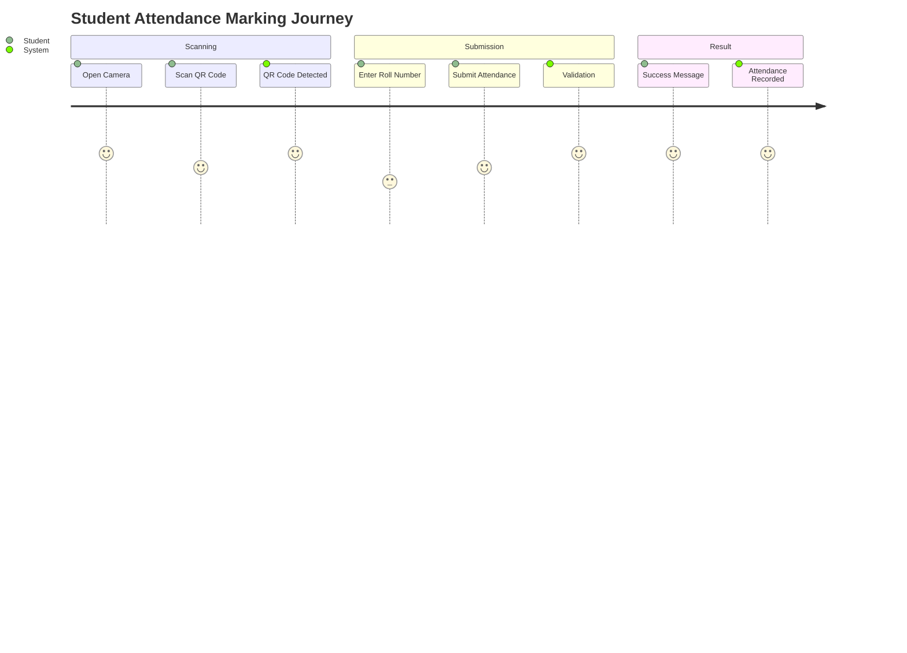
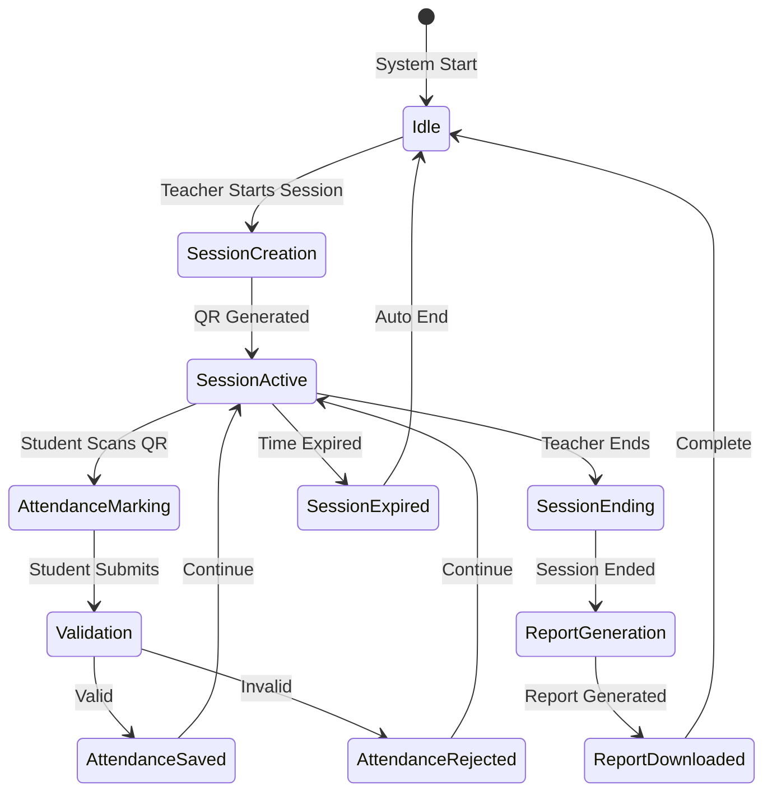
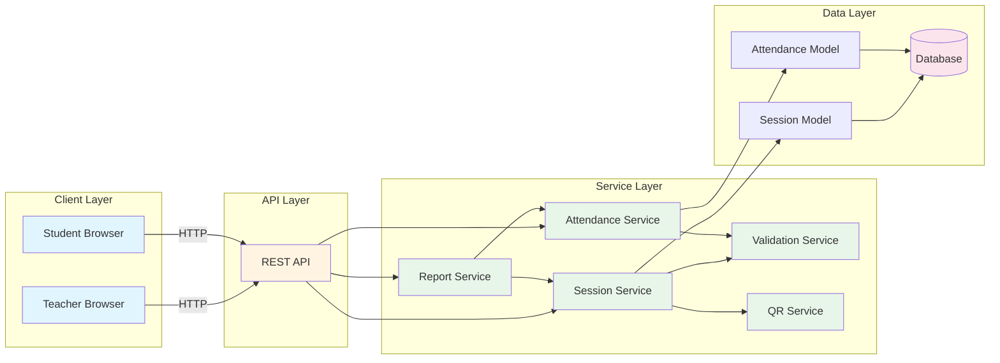

# Flowcharts — AttendRevolution Backend

Updated to reflect the implemented backend flows: no student login, teacher-only session management, QR-based attendance, deviceHash enforcement, and report export.

---

## System Overview



---

## Session Creation Flow



---

## Attendance Marking Flow (student)



---

## Device Protection & Duplicate Prevention

- Device-based attendance protection: device hash prevents multiple submissions from the same device for a session.
- Roll-number uniqueness prevents the same student being marked more than once.

---

## Report Export Flow



---

This file reflects the current behavior implemented in the backend: no student authentication, teacher-protected endpoints, Session QR validation, DB-enforced uniqueness, and device-based attendance protection enforcement.

    CheckExpired -->|Yes| Error403b[403 Forbidden: Expired]
    Error403b --> LogError
    
    CheckExpired -->|No| CheckDuplicate{Duplicate?}
    CheckDuplicate -->|Yes| Error409[409 Conflict: Duplicate]
    Error409 --> LogError
    
    CheckDuplicate -->|No| ProcessSuccess[Process Successfully]
    ProcessSuccess --> SaveData[Save Data]
    SaveData --> Success{Save Successful?}
    
    Success -->|No| Error500[500 Internal Server Error]
    Error500 --> LogError
    
    Success -->|Yes| ReturnSuccess[Return Success Response]
    ReturnSuccess --> End([End])
    ReturnError --> End
    
    style Start fill:#90EE90
    style End fill:#87CEEB
    style Validate fill:#FFD700
    style CheckSession fill:#FFD700
    style CheckActive fill:#FFD700
    style CheckExpired fill:#FFD700
    style CheckDuplicate fill:#FFD700
    style Success fill:#FFD700
    style Error400 fill:#FFB6C1
    style Error404 fill:#FFB6C1
    style Error403a fill:#FFB6C1
    style Error403b fill:#FFB6C1
    style Error409 fill:#FFB6C1
    style Error500 fill:#FFB6C1
```

---

## 7. Complete User Journey

### Teacher Journey



### Student Journey



### Complete System Flow



---

## 8. Data Flow Diagram

### Complete Data Flow



---

## Document Control

| Version | Date | Author | Changes |
|---------|------|--------|---------|
| 1.0.0 | 2026 | Abdul Hakeem Shah | Initial flowcharts |

---

**Document Status:** ✅ Approved  
**Review Date:** As needed  
**Distribution:** Development Team, Stakeholders

