# 📊 System Flowcharts
## QR-Based Proxy-Free Attendance System

**Version:** 1.0.0  
**Last Updated:** 2026

---

## Table of Contents

1. [System Overview Flow](#system-overview-flow)
2. [Session Creation Flow](#session-creation-flow)
3. [Attendance Marking Flow](#attendance-marking-flow)
4. [Session End Flow](#session-end-flow)
5. [Report Generation Flow](#report-generation-flow)
6. [Error Handling Flow](#error-handling-flow)
7. [Complete User Journey](#complete-user-journey)

---

## 1. System Overview Flow

### High-Level System Flow

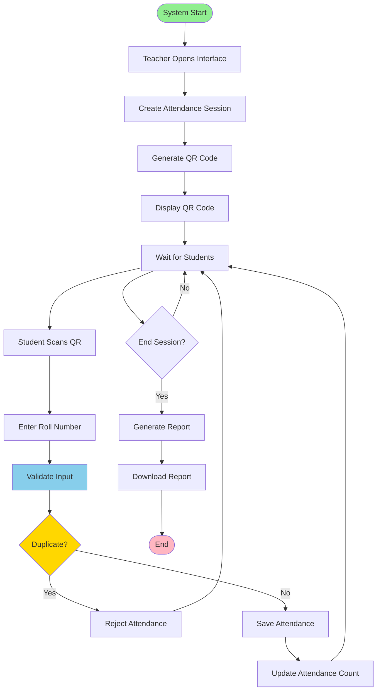

---

## 2. Session Creation Flow

### Teacher Creates Attendance Session

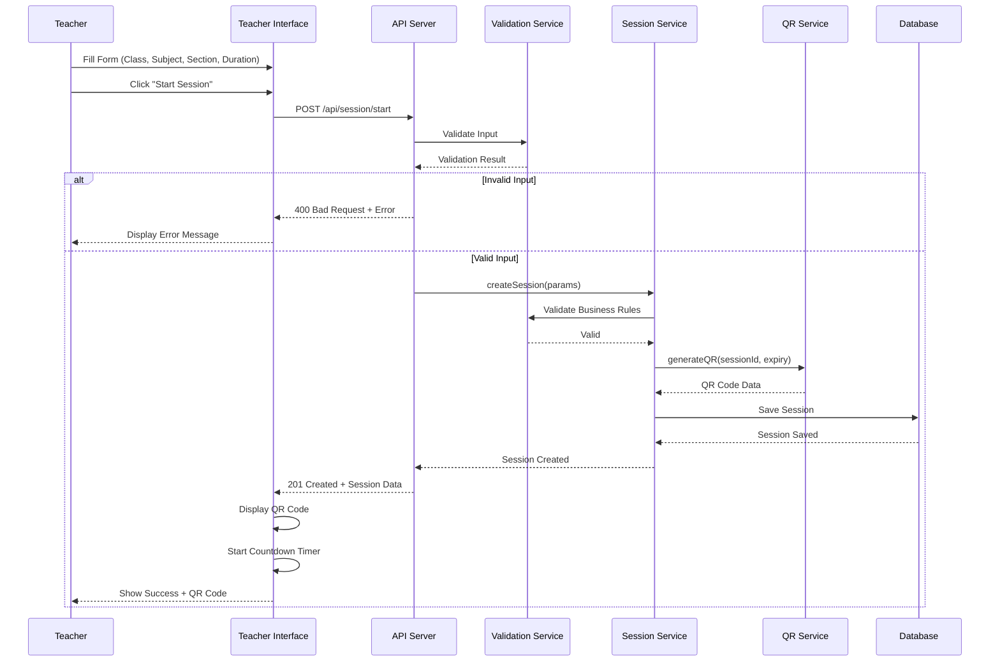

### Session Creation Decision Tree

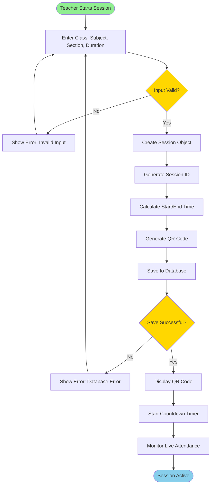

---

## 3. Attendance Marking Flow

### Student Marks Attendance

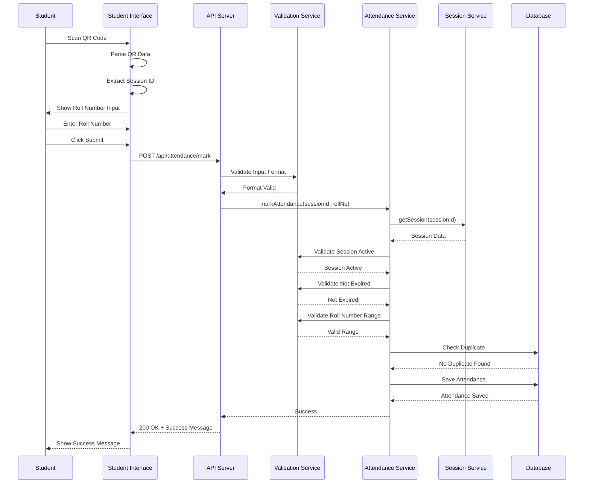

### Attendance Validation Flow

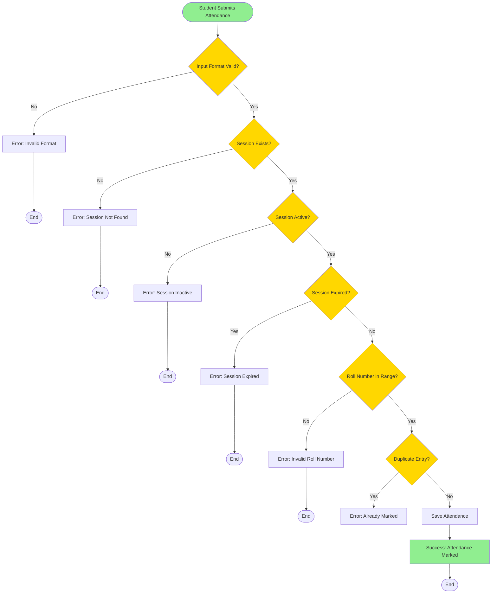

---

## 4. Session End Flow

### Teacher Ends Session

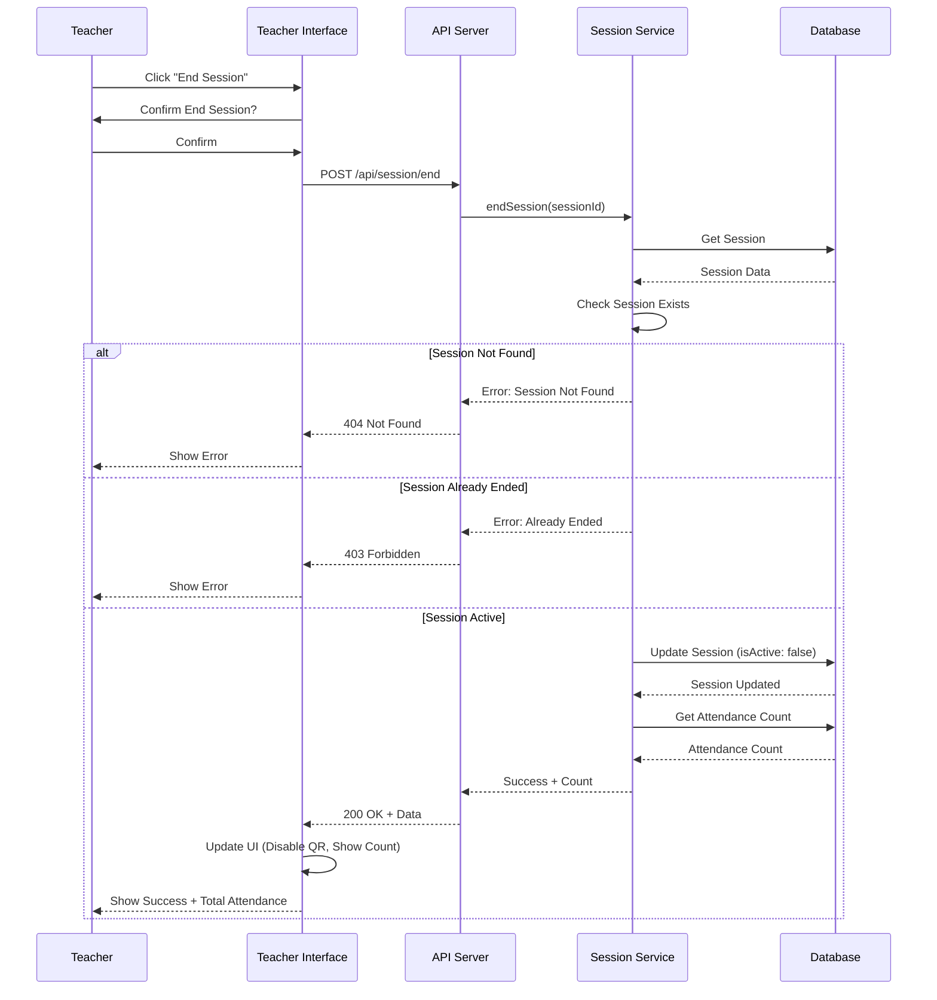

### Session End Decision Tree

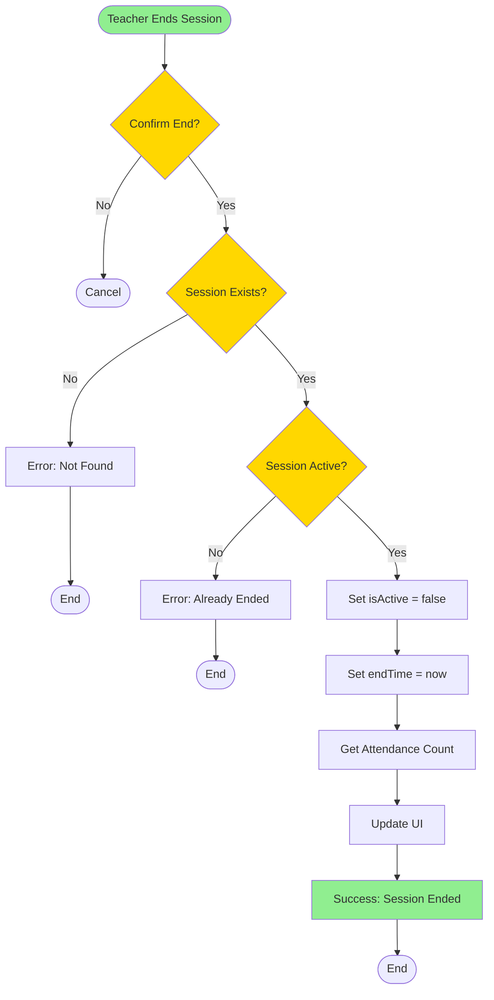

---

## 5. Report Generation Flow

### Generate and Download Report

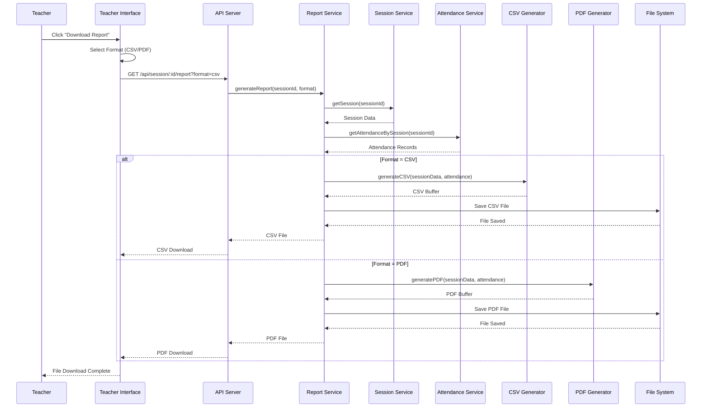

### Report Generation Process

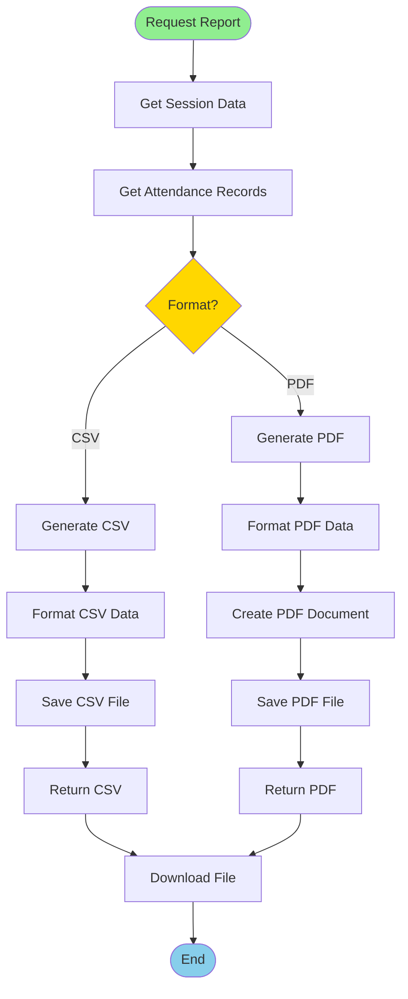

---

## 6. Error Handling Flow

### Complete Error Handling

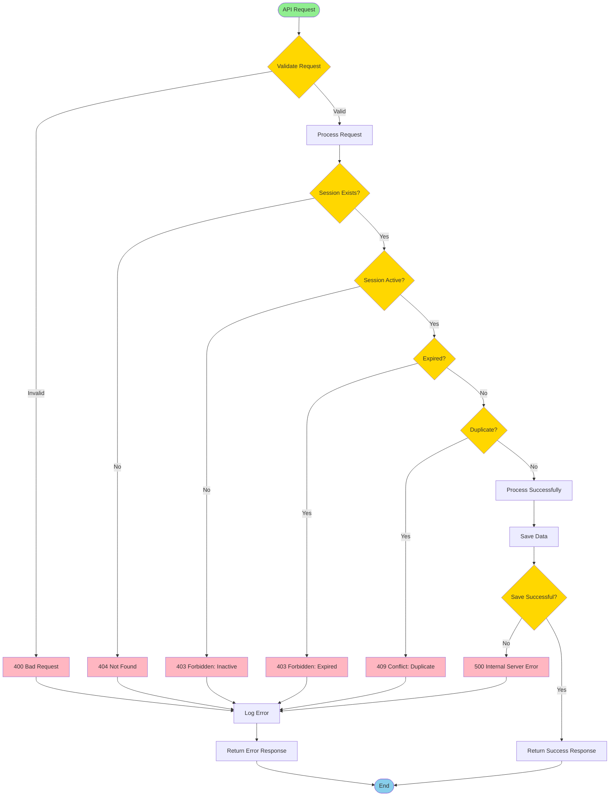

---

## 7. Complete User Journey

### Teacher Journey

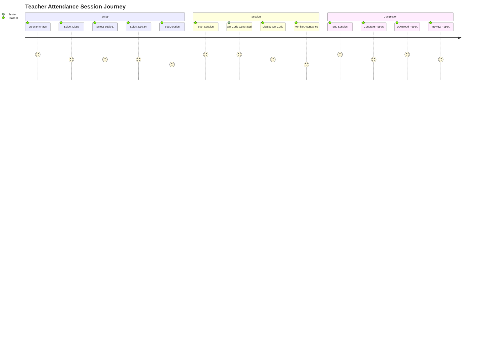

### Student Journey

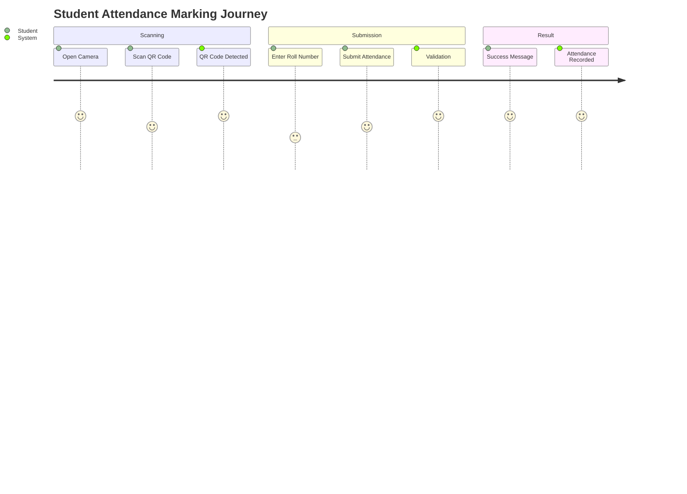

### Complete System Flow

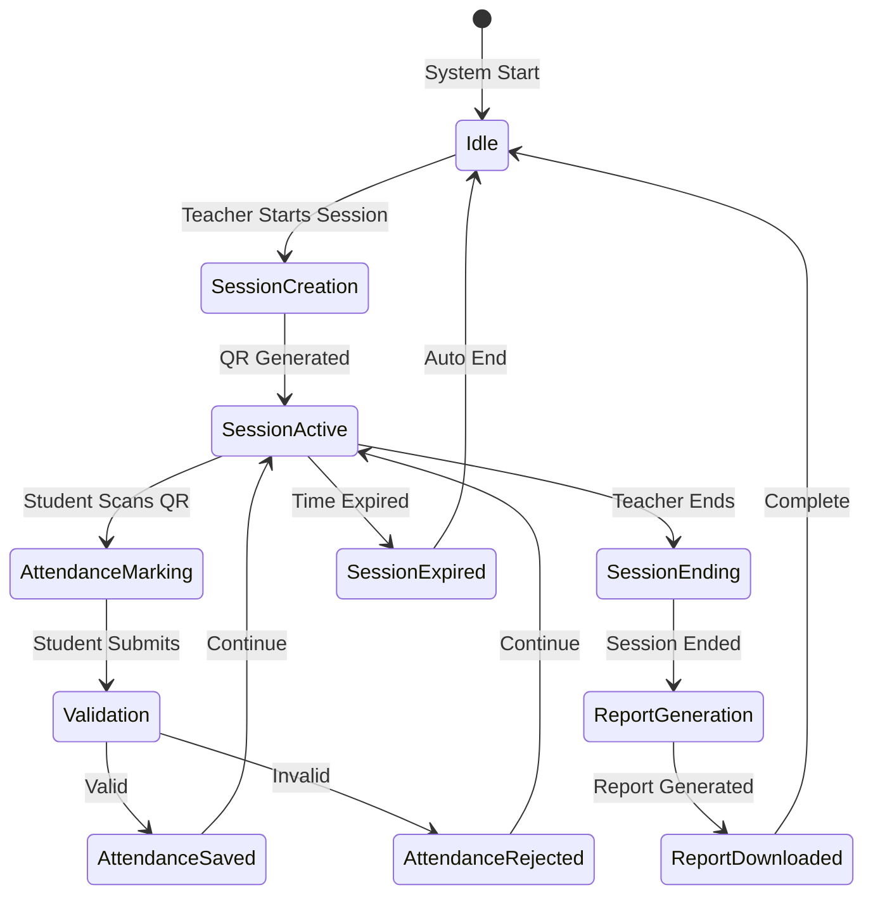

---

## 8. Data Flow Diagram

### Complete Data Flow

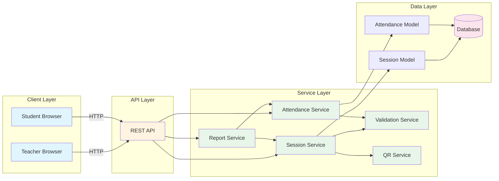

---

## Document Control

| Version | Date | Author | Changes |
|---------|------|--------|---------|
| 1.0.0 | 2026 | Abdul Hakeem Shah | Initial flowcharts |

---

**Document Status:** ✅ Approved  
**Review Date:** As needed  
**Distribution:** Development Team, Stakeholders

