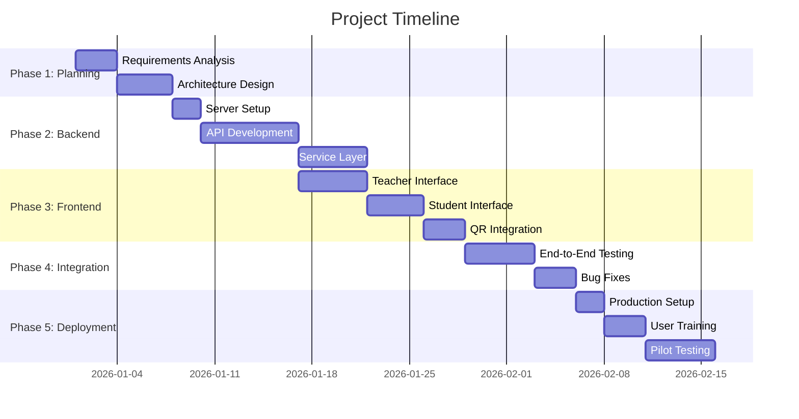

# 📅 Project Plan and Timeline
## QR-Based Proxy-Free Attendance System

**Version:** 1.0.0  
**Project Duration:** 10 Weeks  
**Start Date:** TBD  
**Target Completion:** TBD  
**Last Updated:** 2026

---

## Table of Contents

1. [Project Overview](#project-overview)
2. [Project Phases](#project-phases)
3. [Detailed Timeline](#detailed-timeline)
4. [Milestones](#milestones)
5. [Resource Allocation](#resource-allocation)
6. [Risk Management](#risk-management)
7. [Quality Assurance](#quality-assurance)
8. [Deliverables](#deliverables)
9. [Success Metrics](#success-metrics)

---

## 1. Project Overview

### 1.1 Project Summary

**Project Name:** QR-Based Proxy-Free Attendance System  
**Project Type:** MVP → FYP Ready  
**Development Approach:** Agile/Iterative  
**Team Size:** 1-3 developers  
**Target Users:** Teachers and Students

### 1.2 Project Goals

1. **Primary Goal:** Replace paper-based attendance with QR-based system
2. **Efficiency Goal:** Reduce attendance time to under 5 minutes
3. **Accuracy Goal:** Eliminate manual errors and duplicates
4. **Usability Goal:** Zero learning curve for students
5. **Scalability Goal:** Support 150-200 students per session

### 1.3 Project Scope

**In Scope:**
- Web-based attendance system
- QR code generation and scanning
- Time-limited sessions
- Roll number validation
- Duplicate prevention
- Report generation (CSV/PDF)

**Out of Scope (MVP):**
- User authentication
- Mobile applications
- Advanced proxy prevention
- Analytics dashboard
- ERP integration

---

## 2. Project Phases

### 2.1 Phase Breakdown

### 2.2 Phase Descriptions

#### Phase 1: Planning & Design (Week 1-2)
- Requirements finalization
- Architecture design
- Database schema design
- API specification
- UI/UX mockups
- Project setup

#### Phase 2: Backend Development (Week 3-5)
- Server setup and configuration
- API endpoint implementation
- Service layer development
- Data layer implementation
- Validation logic
- Unit testing

#### Phase 3: Frontend Development (Week 6-7)
- Teacher interface development
- Student interface development
- QR code integration
- Report generation UI
- Client-side validation
- Responsive design

#### Phase 4: Integration & Testing (Week 8)
- End-to-end testing
- Integration testing
- Performance testing
- Security testing
- Bug fixing
- Documentation

#### Phase 5: Deployment & Training (Week 9-10)
- Production deployment
- User training materials
- Teacher training sessions
- Pilot testing
- Feedback collection
- Final adjustments

---

## 3. Detailed Timeline

### Week 1: Planning & Requirements

**Days 1-2: Requirements Analysis**
- [ ] Review project specification
- [ ] Identify functional requirements
- [ ] Identify non-functional requirements
- [ ] Document use cases
- [ ] Create user stories

**Days 3-4: Architecture Design**
- [ ] Design system architecture
- [ ] Create component diagrams
- [ ] Design data flow
- [ ] Plan technology stack
- [ ] Document design decisions

**Days 5-7: API & Database Design**
- [ ] Design REST API endpoints
- [ ] Create API documentation
- [ ] Design database schema
- [ ] Plan data models
- [ ] Design validation rules

**Deliverables:**
- Requirements document
- Architecture document
- API specification
- Database schema

---

### Week 2: Design & Setup

**Days 8-9: UI/UX Design**
- [ ] Design teacher interface mockups
- [ ] Design student interface mockups
- [ ] Create wireframes
- [ ] Design user flows
- [ ] Plan responsive design

**Days 10-11: Project Setup**
- [ ] Initialize project repository
- [ ] Set up development environment
- [ ] Configure build tools
- [ ] Set up version control
- [ ] Create project structure

**Days 12-14: Development Planning**
- [ ] Break down tasks
- [ ] Estimate effort
- [ ] Assign priorities
- [ ] Set up project management tools
- [ ] Create development guidelines

**Deliverables:**
- UI/UX mockups
- Project repository
- Development environment
- Task breakdown

---

### Week 3: Backend Foundation

**Days 15-16: Server Setup**
- [ ] Initialize Node.js project
- [ ] Install dependencies
- [ ] Configure Express server
- [ ] Set up middleware
- [ ] Configure environment variables
- [ ] Set up logging

**Days 17-19: Data Layer**
- [ ] Implement JSON file storage
- [ ] Create data models
- [ ] Implement CRUD operations
- [ ] Add data validation
- [ ] Implement error handling
- [ ] Create backup utilities

**Days 20-21: Basic API Endpoints**
- [ ] Implement session creation endpoint
- [ ] Implement session retrieval endpoint
- [ ] Implement session end endpoint
- [ ] Add input validation
- [ ] Add error handling
- [ ] Write unit tests

**Deliverables:**
- Working server
- Data storage layer
- Basic API endpoints
- Unit tests

---

### Week 4: Backend Core Features

**Days 22-24: Session Service**
- [ ] Implement session service
- [ ] Add session validation
- [ ] Implement time management
- [ ] Add session state management
- [ ] Create session utilities
- [ ] Write service tests

**Days 25-26: QR Code Service**
- [ ] Integrate QR code library
- [ ] Implement QR generation
- [ ] Add QR data encoding
- [ ] Implement QR validation
- [ ] Add QR expiry logic
- [ ] Test QR generation

**Days 27-28: Attendance Service**
- [ ] Implement attendance service
- [ ] Add duplicate prevention
- [ ] Implement roll number validation
- [ ] Add session validation
- [ ] Implement timestamp recording
- [ ] Write service tests

**Deliverables:**
- Session service
- QR code service
- Attendance service
- Service layer tests

---

### Week 5: Backend Completion

**Days 29-30: Validation Service**
- [ ] Implement input validation
- [ ] Add business rule validation
- [ ] Implement session validation
- [ ] Add roll number validation
- [ ] Create validation utilities
- [ ] Write validation tests

**Days 31-32: Report Service**
- [ ] Implement CSV generation
- [ ] Implement PDF generation
- [ ] Add report formatting
- [ ] Implement file storage
- [ ] Add report download endpoint
- [ ] Test report generation

**Days 33-35: API Completion**
- [ ] Complete all API endpoints
- [ ] Add error handling
- [ ] Implement logging
- [ ] Add API documentation
- [ ] Write integration tests
- [ ] Performance testing

**Deliverables:**
- Complete backend API
- Report generation
- Integration tests
- API documentation

---

### Week 6: Frontend - Teacher Interface

**Days 36-37: Teacher UI Setup**
- [ ] Create HTML structure
- [ ] Set up CSS framework
- [ ] Configure JavaScript modules
- [ ] Set up API client
- [ ] Create base components
- [ ] Add error handling

**Days 38-40: Session Management UI**
- [ ] Create session form
- [ ] Add class/subject/section inputs
- [ ] Implement session creation
- [ ] Add session list display
- [ ] Implement session end functionality
- [ ] Add real-time updates

**Days 41-42: QR Code Display**
- [ ] Integrate QR code display
- [ ] Add QR code refresh
- [ ] Implement countdown timer
- [ ] Add QR code download
- [ ] Create QR display component
- [ ] Test QR display

**Deliverables:**
- Teacher interface
- Session management UI
- QR code display
- Basic styling

---

### Week 7: Frontend - Student Interface & Reports

**Days 43-44: Student UI Setup**
- [ ] Create student HTML structure
- [ ] Set up mobile-responsive CSS
- [ ] Configure QR scanner
- [ ] Set up form handling
- [ ] Add API integration
- [ ] Create feedback components

**Days 45-46: QR Scanning & Submission**
- [ ] Integrate QR scanner library
- [ ] Implement QR code parsing
- [ ] Add roll number input
- [ ] Implement attendance submission
- [ ] Add success/error feedback
- [ ] Test on mobile devices

**Days 47-49: Report UI & Polish**
- [ ] Create report download UI
- [ ] Add report format selection
- [ ] Implement download functionality
- [ ] Add loading states
- [ ] Polish UI/UX
- [ ] Cross-browser testing

**Deliverables:**
- Student interface
- QR scanning functionality
- Report download UI
- Responsive design

---

### Week 8: Integration & Testing

**Days 50-52: End-to-End Testing**
- [ ] Test complete user flows
- [ ] Test teacher workflow
- [ ] Test student workflow
- [ ] Test error scenarios
- [ ] Test edge cases
- [ ] Document test results

**Days 53-54: Performance Testing**
- [ ] Load testing (150+ concurrent users)
- [ ] Response time testing
- [ ] Memory usage testing
- [ ] File I/O performance
- [ ] Optimize bottlenecks
- [ ] Performance report

**Days 55-56: Bug Fixes & Refinement**
- [ ] Fix identified bugs
- [ ] Improve error messages
- [ ] Enhance user experience
- [ ] Optimize code
- [ ] Update documentation
- [ ] Code review

**Deliverables:**
- Test reports
- Bug fixes
- Performance optimizations
- Updated documentation

---

### Week 9: Deployment Preparation

**Days 57-58: Production Setup**
- [ ] Configure production environment
- [ ] Set up process manager (PM2)
- [ ] Configure logging
- [ ] Set up monitoring
- [ ] Configure backups
- [ ] Security hardening

**Days 59-61: User Training Materials**
- [ ] Create user manual
- [ ] Create video tutorials
- [ ] Prepare training slides
- [ ] Create FAQ document
- [ ] Prepare troubleshooting guide
- [ ] Create quick start guide

**Days 62-63: Pre-Deployment Testing**
- [ ] Test in production-like environment
- [ ] Verify all features
- [ ] Test backup/restore
- [ ] Verify monitoring
- [ ] Final security check
- [ ] Deployment checklist

**Deliverables:**
- Production environment
- User training materials
- Deployment documentation
- Pre-deployment test results

---

### Week 10: Deployment & Launch

**Days 64-65: Production Deployment**
- [ ] Deploy to production server
- [ ] Verify deployment
- [ ] Test production environment
- [ ] Monitor initial usage
- [ ] Fix deployment issues
- [ ] Document deployment

**Days 66-67: User Training**
- [ ] Conduct teacher training
- [ ] Provide student instructions
- [ ] Answer questions
- [ ] Collect feedback
- [ ] Update documentation
- [ ] Create support channels

**Days 68-70: Pilot Testing & Feedback**
- [ ] Run pilot sessions
- [ ] Monitor system performance
- [ ] Collect user feedback
- [ ] Make adjustments
- [ ] Document lessons learned
- [ ] Plan improvements

**Deliverables:**
- Deployed system
- Trained users
- Pilot test results
- Feedback report
- Final documentation

---

## 4. Milestones

### Milestone 1: Planning Complete (End of Week 2)
**Date:** TBD  
**Deliverables:**
- ✅ Requirements document
- ✅ Architecture design
- ✅ API specification
- ✅ Database schema
- ✅ UI/UX mockups
- ✅ Project setup

**Success Criteria:**
- All design documents approved
- Project structure created
- Development environment ready

---

### Milestone 2: Backend Complete (End of Week 5)
**Date:** TBD  
**Deliverables:**
- ✅ All API endpoints implemented
- ✅ Service layer complete
- ✅ Data layer complete
- ✅ Unit tests passing
- ✅ Integration tests passing

**Success Criteria:**
- All API endpoints functional
- Tests passing (>80% coverage)
- Documentation complete

---

### Milestone 3: Frontend Complete (End of Week 7)
**Date:** TBD  
**Deliverables:**
- ✅ Teacher interface complete
- ✅ Student interface complete
- ✅ QR scanning functional
- ✅ Report generation UI
- ✅ Responsive design

**Success Criteria:**
- All UI components functional
- Mobile-responsive
- Cross-browser compatible

---

### Milestone 4: Testing Complete (End of Week 8)
**Date:** TBD  
**Deliverables:**
- ✅ All tests passing
- ✅ Performance benchmarks met
- ✅ Bug fixes completed
- ✅ Documentation updated

**Success Criteria:**
- System handles 150+ concurrent users
- Response time <2 seconds
- Zero critical bugs

---

### Milestone 5: Deployment Complete (End of Week 10)
**Date:** TBD  
**Deliverables:**
- ✅ System deployed to production
- ✅ Users trained
- ✅ Pilot testing complete
- ✅ Feedback collected

**Success Criteria:**
- System operational in production
- Users successfully using system
- Positive feedback received

---

## 5. Resource Allocation

### 5.1 Team Roles

| Role | Responsibilities | Time Allocation |
|------|-----------------|----------------|
| Backend Developer | API, Services, Data Layer | 40% |
| Frontend Developer | UI, QR Integration, Reports | 35% |
| Full-Stack Developer | Integration, Testing, Deployment | 25% |

### 5.2 Skill Requirements

**Backend Developer:**
- Node.js and Express.js
- REST API design
- Data modeling
- Testing frameworks

**Frontend Developer:**
- HTML5, CSS3, JavaScript
- QR code libraries
- Responsive design
- Mobile browser APIs

**Full-Stack Developer:**
- End-to-end integration
- Performance optimization
- Deployment and DevOps
- User training

### 5.3 Tools & Resources

| Resource | Purpose | Cost |
|----------|---------|------|
| Development Server | Local development | Free |
| Production Server | Hosting (future) | TBD |
| Code Editor | VS Code | Free |
| Version Control | Git/GitHub | Free |
| Testing Tools | Jest, Postman | Free |
| Documentation | Markdown | Free |

---

## 6. Risk Management

### 6.1 Risk Register

| Risk | Probability | Impact | Mitigation Strategy |
|------|------------|--------|-------------------|
| Timeline delays | Medium | High | Buffer time, prioritize MVP features |
| Technical challenges | Medium | Medium | Research, proof of concepts, expert consultation |
| Scope creep | Medium | Medium | Strict scope control, change management |
| Resource unavailability | Low | High | Cross-training, documentation |
| Performance issues | Medium | High | Early performance testing, optimization |
| User adoption resistance | Low | Medium | Training, user-friendly design |

### 6.2 Risk Mitigation Plan

**Timeline Delays:**
- Add 20% buffer to each phase
- Prioritize core features
- Defer non-essential features

**Technical Challenges:**
- Research before implementation
- Create proof of concepts
- Consult experts if needed

**Scope Creep:**
- Document scope clearly
- Require approval for changes
- Track all change requests

**Performance Issues:**
- Early load testing
- Performance monitoring
- Optimization iterations

---

## 7. Quality Assurance

### 7.1 Testing Strategy

**Unit Testing:**
- Target: >80% code coverage
- Tools: Jest
- Frequency: During development

**Integration Testing:**
- API endpoint testing
- Service integration testing
- Tools: Jest, Supertest

**End-to-End Testing:**
- Complete user workflows
- Cross-browser testing
- Mobile device testing

**Performance Testing:**
- Load testing (150+ users)
- Response time testing
- Tools: Artillery, Apache Bench

**Security Testing:**
- Input validation testing
- SQL injection testing (if applicable)
- XSS testing

### 7.2 Code Quality

**Standards:**
- ESLint configuration
- Code review process
- Documentation requirements
- Comment standards

**Metrics:**
- Code coverage >80%
- Zero critical bugs
- Response time <2 seconds
- Error rate <1%

---

## 8. Deliverables

### 8.1 Documentation Deliverables

- [x] Project Documentation
- [x] Architecture Documentation
- [x] API Documentation
- [x] Database Schema Documentation
- [x] Setup Guide
- [x] Project Plan
- [ ] User Manual
- [ ] Developer Guide
- [ ] API Postman Collection
- [ ] Deployment Guide

### 8.2 Code Deliverables

- [ ] Backend API (Node.js/Express)
- [ ] Frontend Teacher Interface
- [ ] Frontend Student Interface
- [ ] QR Code Generation Service
- [ ] Report Generation Service
- [ ] Data Storage Layer
- [ ] Unit Tests
- [ ] Integration Tests

### 8.3 Deployment Deliverables

- [ ] Production-ready code
- [ ] Deployment scripts
- [ ] Environment configuration
- [ ] Monitoring setup
- [ ] Backup procedures
- [ ] User training materials

---

## 9. Success Metrics

### 9.1 Technical Metrics

| Metric | Target | Measurement |
|--------|--------|-------------|
| API Response Time | <2 seconds | Performance testing |
| System Uptime | >99% | Monitoring |
| Code Coverage | >80% | Test reports |
| Error Rate | <1% | Error logs |
| Concurrent Users | 150+ | Load testing |

### 9.2 Business Metrics

| Metric | Target | Measurement |
|--------|--------|-------------|
| Attendance Time | <5 minutes | User feedback |
| Student Submission Time | <10 seconds | Analytics |
| User Satisfaction | >90% | Surveys |
| Duplicate Prevention | 100% | System logs |
| Adoption Rate | >80% | Usage statistics |

### 9.3 Quality Metrics

| Metric | Target | Measurement |
|--------|--------|-------------|
| Critical Bugs | 0 | Bug tracking |
| Documentation Coverage | 100% | Documentation review |
| User Training Completion | >90% | Training records |
| Support Tickets | <5/week | Support system |

---

## 10. Communication Plan

### 10.1 Stakeholder Updates

**Frequency:** Weekly  
**Format:** Status report  
**Content:**
- Progress summary
- Completed tasks
- Upcoming tasks
- Risks and issues
- Metrics

### 10.2 Team Meetings

**Daily Standup:** 15 minutes (if team >1 person)
- What was done yesterday?
- What will be done today?
- Any blockers?

**Weekly Review:** 1 hour
- Review progress
- Discuss challenges
- Plan next week

**Sprint Retrospective:** End of each phase
- What went well?
- What could be improved?
- Action items

---

## 11. Change Management

### 11.1 Change Request Process

1. **Request:** Document change request
2. **Assessment:** Evaluate impact on timeline/scope
3. **Approval:** Get stakeholder approval
4. **Implementation:** Implement change
5. **Documentation:** Update documentation

### 11.2 Scope Change Policy

- **Minor changes:** Can be accommodated within buffer
- **Major changes:** Require timeline adjustment
- **Critical changes:** May require phase extension

---

## 12. Post-Project Activities

### 12.1 Maintenance Plan

**Daily:**
- Monitor system logs
- Check backups
- Review error reports

**Weekly:**
- Performance review
- User feedback review
- Bug triage

**Monthly:**
- System updates
- Security patches
- Performance optimization

### 12.2 Future Enhancements

**Phase 2 (Future):**
- User authentication
- Advanced proxy prevention
- Analytics dashboard
- Mobile applications
- ERP integration

---

## 13. Conclusion

This project plan provides a structured approach to developing the QR-Based Attendance System. The 10-week timeline is designed to deliver a functional MVP while maintaining quality and meeting all success criteria.

**Key Success Factors:**
- Clear milestones and deliverables
- Risk management
- Quality assurance
- Regular communication
- User-focused approach

**Next Steps:**
1. Review and approve project plan
2. Assign team members
3. Set up project management tools
4. Begin Phase 1: Planning & Design

---

## Document Control

| Version | Date | Author | Changes |
|---------|------|--------|---------|
| 1.0.0 | 2026 | Abdul Hakeem Shah | Initial project plan |

---

**Document Status:** ✅ Approved  
**Review Date:** Weekly  
**Distribution:** All Stakeholders, Development Team

