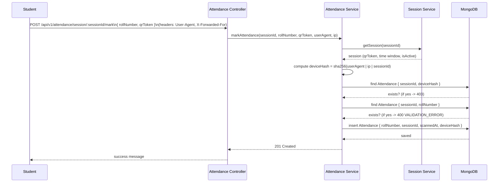

# 🚀 AttendRevolution — Backend (API-first)

# 🚀 AttendRevolution — Backend (API-first)

> Modern, secure, and scalable QR-based attendance for classrooms and institutions.

---

[](docs/PROJECT_STATUS.md) [](https://github.com/) [](https://nodejs.org/) [](LICENSE)


## Table of Contents

1. [Why AttendRevolution?](#why-attendrevolution)
2. [Key Highlights](#key-highlights)
3. [Features (Teachers / Students / System)](#features)
4. [Quick Start](#quick-start)
5. [Architecture & Flow](#architecture--flow)
6. [API Overview (examples)](#api-overview-examples)
7. [Technology Stack](#technology-stack)
8. [Roadmap & Project Status](#roadmap--project-status)
9. [Security & Privacy](#security--privacy)
10. [Contributing & Support](#contributing--support)

---

## Why AttendRevolution?

- ✅ Built for scale: fast QR-driven marking for large classes (150+ students)
- ⚡ Low friction: students need only scan a Session QR and enter `rollNumber`
- 🔒 Focused on integrity: device-based attendance protection and DB-level deduplication
- 📊 Trusted reporting: exportable CSV/PDF with date-range filters for compliance

AttendRevolution is designed to be institution-ready — low overhead, simple UX, and robust backend protections.

---

## ✨ Key Highlights

| Icon | What | Why it matters |
|---:|---|---|
| ✅ | Teacher ID | Lightweight header-based teacher authentication (`teacher-id`) for protected endpoints |
| ⚡ | Session QR | Time-limited QR tokens (`qrToken`) tied to `sessionId` for secure marking |
| 🔒 | Device protection | `deviceHash = sha256(User-Agent | IP | sessionId)` — prevents one device from marking multiple students |
| ⏱️ | QR expiry | Short active window (3–5 minutes typical) prevents proxying and stale scans |
| 📈 | Reports | CSV / PDF exports optimized with `.select()` + `.lean()` for speed |

---

## Features

### Teachers

| Feature | Endpoint | Benefit |
|---|---:|---|
| Create session | `POST /api/v1/sessions` | Returns `{ sessionId, qrToken }` (Session QR) for immediate display |
| Monitor / end session | `PATCH /api/v1/sessions/:id` | Start/stop sessions and control QR validity |
| Export reports | `GET /api/v1/reports/session/:sessionId/{csv|pdf}` | Download cleaned attendance data for records |

### Students

- Scan the Session QR on teacher screen (or copy session URL)
- Submit `rollNumber` + `qrToken` to `POST /api/v1/attendance/session/:sessionId/mark`
- Receive immediate feedback when marked or rejected (invalid/expired QR, duplicate roll, device-block)

### System Protections

- DB uniqueness: `{ sessionId, rollNumber }` prevents duplicate roll submissions
- Device fingerprint uniqueness: `{ sessionId, deviceHash }` prevents multiple students being marked from one device
- Session QR validation and time-window enforcement prevent stale/proxy submissions

---

## ⚡ Quick Start (Development)

Clone, install, and run locally:

```powershell
git clone https://github.com/your-org/attendrevolution.git
cd attendRevolution
npm install
```

Create `.env` (example):

```text
MONGODB_URI=mongodb://localhost:27017/attendrevolution
PORT=3000
NODE_ENV=development
```

Start the server:

```powershell
npm start
```

Run tests:

```powershell
npm test -- --runInBand --color --verbose
```

Notes: `NODE_ENV=test` disables auto-start DB/listen to allow clean Jest runs.

---

## 🏗️ Architecture & Flow

- Express API server → Services layer → Mongoose models → MongoDB

### Sequence: Student marks attendance (visual)



---

## 🧾 API Overview — Quick Examples

1) Create session (Teacher):

```bash
curl -X POST http://localhost:3000/api/v1/sessions \
  -H "teacher-id: T-ABC-123" \
  -H "Content-Type: application/json" \
  -d '{"course":"CS101","date":"2026-01-04","timeFrom":"09:00","timeTo":"09:05"}'
```

Response (201):

```json
{ "data": { "sessionId": "605c...abcd", "qrToken": "X7f9K2qL" } }
```

2) Mark attendance (Student):

```bash
curl -X POST http://localhost:3000/api/v1/attendance/session/605c...abcd/mark \
  -H "Content-Type: application/json" \
  -H "User-Agent: Mozilla/5.0 (mobile)" \
  -H "X-Forwarded-For: 203.0.113.5" \
  -d '{"rollNumber":"2026CS101","qrToken":"X7f9K2qL"}'
```

Success (201):

```json
{ "message": "Attendance recorded", "data": { "rollNumber":"2026CS101","scannedAt":"2026-01-04T09:01:12Z" } }
```

Error cases:
- 400 VALIDATION_ERROR — invalid QR token or duplicate roll
- 403 Forbidden — device-based attendance protection triggered (same device tried earlier)

For full API shapes and examples: `docs/API.md`.

---

## 🛠️ Technology Stack

- Node.js 18+
- Express.js
- MongoDB + Mongoose
- Jest + Supertest (tests)
- qrcode, csv-writer, pdfkit
- Node `crypto` for SHA-256 device hashing

---

## 📈 Roadmap & Project Status

- [ ] Integration tests (in-memory MongoDB)
- [ ] OpenAPI / Swagger generation
- [ ] CI: GitHub Actions to run tests & lint
- [ ] Streaming export for huge reports
- [ ] Enterprise SSO / OAuth for teachers

Current status: Backend: COMPLETE — core flows implemented and tested. See `docs/PROJECT_STATUS.md`.

---

## 🔒 Security & Privacy

- No student login: students submit only `rollNumber` + Session QR (reduced friction)
- Teacher-only endpoints protected by Teacher ID (`teacher-id` header) via `teacherAuth`
- Device-based attendance protection reduces proxying; consider additional measures for production (IP throttling, rate-limits, CAPTCHA, identity verification)

---

## 🤝 Contributing & Support

Found an issue or want a feature? Please open an issue or a PR. Suggested next small wins:

- Add OpenAPI generation
- Add Docker Compose for quick local setup
- Integrate in-memory DB tests in CI

For quick help, tag @maintainer in issues or email the project owner.

---

## 📜 License

MIT — see LICENSE

---

## Next steps (recommended)

The following tasks are recommended to improve developer experience, CI, and deployability:

- [ ] Generate an OpenAPI / Swagger specification from `docs/API.md` and expose a Swagger UI
- [ ] Add a GitHub Actions workflow to run `npm test` and lint on push (CI badge)
- [ ] Provide a `docker-compose` setup for local development (app + MongoDB)
- [ ] Scaffold a minimal frontend demo (single-page) that consumes the API endpoints
- [ ] Add integration tests using an in-memory MongoDB for CI runs

Contributions for these tasks are welcome; see `CONTRIBUTING.md` (create one if needed).

