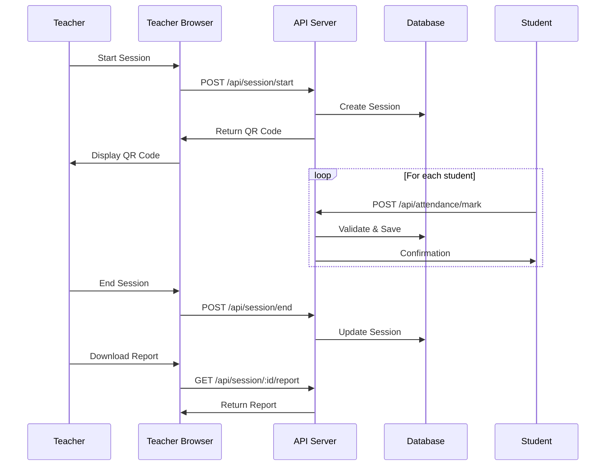

# 📘 QR-Based Proxy-Free Attendance System

**A modern, efficient web-based attendance management system designed for large classrooms (150-200 students)**

[](https://github.com/your-repo)
[](LICENSE)
[](https://nodejs.org/)

---

## 📋 Table of Contents

- [Overview](#overview)
- [Features](#features)
- [Quick Start](#quick-start)
- [Documentation](#documentation)
- [Architecture](#architecture)
- [Technology Stack](#technology-stack)
- [Project Structure](#project-structure)
- [API Documentation](#api-documentation)
- [Installation](#installation)
- [Usage](#usage)
- [Testing](#testing)
- [Contributing](#contributing)
- [License](#license)

---

## 🎯 Overview

The **QR-Based Proxy-Free Attendance System** is a modern solution that replaces traditional paper-based attendance tracking with a fast, reliable, and automated QR code-based system. Designed specifically for large classroom environments, the system enables teachers to complete attendance in under 5 minutes while students can mark their attendance in under 10 seconds.

### Key Highlights

- ⚡ **Fast:** Complete attendance in under 5 minutes
- 📱 **Mobile-Friendly:** Works on any device with a camera
- 🔒 **Secure:** Server-side validation prevents proxy attendance
- 📊 **Automated Reports:** Generate CSV and PDF reports instantly
- 🎯 **Simple:** Zero learning curve for students
- 📈 **Scalable:** Supports 150+ concurrent students

---

## ✨ Features

### For Teachers
- ✅ Create attendance sessions with class, subject, and section
- ✅ Generate time-limited QR codes (3-5 minutes)
- ✅ Monitor live attendance count
- ✅ End sessions manually or automatically
- ✅ Download attendance reports (CSV/PDF)

### For Students
- ✅ Scan QR code using mobile browser
- ✅ Enter roll number to mark attendance
- ✅ Receive instant feedback
- ✅ No app installation required

### System Features
- ✅ Time-limited QR codes prevent proxy attendance
- ✅ Server-side duplicate prevention
- ✅ Real-time validation
- ✅ Automatic session expiry
- ✅ Comprehensive error handling
- ✅ Audit trail for all operations

---

## 🚀 Quick Start

### Prerequisites

- Node.js 18.0.0 or higher
- npm 9.0.0 or higher

### Installation

```bash
# Clone the repository
git clone <repository-url>
cd attendRevolution

# Install dependencies
npm install

# Create data directories
mkdir -p server/data reports/csv reports/pdf

# Initialize data files
echo "[]" > server/data/sessions.json
echo "[]" > server/data/attendance.json

# Start the server
npm start
```

### Access the Application

- **Teacher Interface:** http://localhost:3000/teacher
- **Student Interface:** http://localhost:3000/student
- **API Endpoint:** http://localhost:3000/api

---

## 📚 Documentation

Comprehensive documentation is available for all aspects of the project:

### Core Documentation

| Document | Description |
|----------|-------------|
| [📘 Project Documentation](./PROJECT_DOCUMENTATION.md) | Complete project overview, requirements, and scope |
| [🏗️ Architecture Documentation](./ARCHITECTURE.md) | System architecture, components, and design patterns |
| [🔌 API Documentation](./API_DOCUMENTATION.md) | Complete REST API reference with examples |
| [💾 Database Schema](./DATABASE_SCHEMA.md) | Data models, schemas, and relationships |
| [🚀 Setup Guide](./SETUP_GUIDE.md) | Detailed installation and configuration guide |
| [📅 Project Plan](./PROJECT_PLAN.md) | Timeline, milestones, and project management |
| [🚀 Complete Beginner Guide](./COMPLETE_GUIDE.md) | **START HERE** - Step-by-step guide from zero to completion |

### Quick Links

- [Architecture Overview](./ARCHITECTURE.md#architecture-overview)
- [API Endpoints](./API_DOCUMENTATION.md#endpoints)
- [Database Models](./DATABASE_SCHEMA.md#data-models)
- [Installation Steps](./SETUP_GUIDE.md#installation-steps)
- [Project Timeline](./PROJECT_PLAN.md#detailed-timeline)

---

## 🏗️ Architecture

### High-Level Architecture

```
┌─────────────────┐
│ Teacher Browser │
└────────┬────────┘
         │ REST API
         ▼
┌─────────────────────┐
│ Node.js + Express   │
│      Server         │
└────────┬────────────┘
         │
         ▼
┌─────────────────────┐
│  Data Storage       │
│ (JSON / MongoDB)    │
└─────────────────────┘
         ▲
         │
┌────────┴────────┐
│ Student Browser │
└─────────────────┘
```

### Layered Architecture

```
Presentation Layer (HTML/CSS/JS)
         ↓
Controller Layer (Routes)
         ↓
Service Layer (Business Logic)
         ↓
Data Layer (Storage)
```

For detailed architecture documentation, see [ARCHITECTURE.md](./ARCHITECTURE.md).

---

## 🛠️ Technology Stack

### Backend
- **Runtime:** Node.js 18+
- **Framework:** Express.js 4.x
- **QR Generation:** qrcode library
- **Reports:** csv-writer, pdfkit
- **Validation:** Custom validation service

### Frontend
- **Markup:** HTML5
- **Styling:** CSS3
- **Scripting:** JavaScript (ES6+)
- **QR Scanning:** Browser Camera API

### Data Storage
- **MVP:** JSON files
- **Production:** MongoDB (future)

### Development Tools
- **Package Manager:** npm
- **Version Control:** Git
- **Testing:** Jest
- **Code Quality:** ESLint

---

## 📁 Project Structure

```
attendRevolution/
│
├── client/
│   ├── teacher/
│   │   ├── index.html
│   │   ├── teacher.js
│   │   └── style.css
│   │
│   └── student/
│       ├── scan.html
│       ├── student.js
│       └── style.css
│
├── server/
│   ├── app.js
│   │
│   ├── routes/
│   │   ├── session.routes.js
│   │   └── attendance.routes.js
│   │
│   ├── controllers/
│   │   ├── session.controller.js
│   │   └── attendance.controller.js
│   │
│   ├── services/
│   │   ├── session.service.js
│   │   ├── qr.service.js
│   │   ├── validation.service.js
│   │   └── report.service.js
│   │
│   ├── models/
│   │   ├── session.model.js
│   │   └── attendance.model.js
│   │
│   ├── data/
│   │   ├── sessions.json
│   │   └── attendance.json
│   │
│   └── utils/
│       ├── time.util.js
│       └── file.util.js
│
├── reports/
│   ├── csv/
│   └── pdf/
│
├── docs/
│   ├── PROJECT_DOCUMENTATION.md
│   ├── ARCHITECTURE.md
│   ├── API_DOCUMENTATION.md
│   ├── DATABASE_SCHEMA.md
│   ├── SETUP_GUIDE.md
│   └── PROJECT_PLAN.md
│
├── package.json
└── README.md
```

---

## 🔌 API Documentation

### Quick API Reference

#### Start Session
```http
POST /api/session/start
Content-Type: application/json

{
  "class": "CS-101",
  "subject": "Data Structures",
  "section": "A",
  "duration": 5
}
```

#### Mark Attendance
```http
POST /api/attendance/mark
Content-Type: application/json

{
  "sessionId": "550e8400-e29b-41d4-a716-446655440000",
  "rollNo": 12345
}
```

#### End Session
```http
POST /api/session/end
Content-Type: application/json

{
  "sessionId": "550e8400-e29b-41d4-a716-446655440000"
}
```

#### Download Report
```http
GET /api/session/:sessionId/report?format=csv
```

For complete API documentation, see [API_DOCUMENTATION.md](./API_DOCUMENTATION.md).

---

## 💻 Usage

### Starting an Attendance Session

1. **Teacher opens** the teacher interface
2. **Selects** class, subject, and section
3. **Sets** session duration (3-5 minutes)
4. **Clicks** "Start Session"
5. **QR code** is displayed on screen
6. **Students scan** QR code and enter roll number
7. **Teacher monitors** live attendance count
8. **Ends session** when complete
9. **Downloads** attendance report

### Marking Attendance (Student)

1. **Open** mobile browser
2. **Scan** QR code displayed by teacher
3. **Enter** roll number
4. **Submit** attendance
5. **Receive** confirmation message

---

## 🧪 Testing

### Run Tests

```bash
# Run all tests
npm test

# Run with coverage
npm test -- --coverage

# Run specific test file
npm test -- session.test.js
```

### Test Coverage

Target: >80% code coverage

### Manual Testing

1. **API Testing:** Use Postman collection
2. **UI Testing:** Test on multiple browsers
3. **Mobile Testing:** Test on iOS and Android
4. **Load Testing:** Test with 150+ concurrent users

---

## 📊 System Flow

### Complete Attendance Flow



---

## 🎯 Success Criteria

The system is considered successful if:

- ✅ Teacher completes attendance in under 5 minutes
- ✅ Students mark attendance in under 10 seconds
- ✅ Duplicate entries are blocked 100% of the time
- ✅ Reports generate correctly
- ✅ System works consistently in live demos
- ✅ Handles 150+ concurrent student submissions

---

## 🔒 Security Features

- **Server-side validation:** All inputs validated on server
- **Time-limited sessions:** QR codes expire automatically
- **Duplicate prevention:** One entry per roll number per session
- **Input sanitization:** Prevents injection attacks
- **Error handling:** No sensitive data in error messages

---

## 🚧 Roadmap

### MVP (Current)
- ✅ Core attendance functionality
- ✅ QR code generation
- ✅ Report generation
- ✅ Basic proxy prevention

### Phase 2 (Future)
- 🔄 User authentication
- 🔄 Advanced proxy prevention (MAC address, device fingerprinting)
- 🔄 Analytics dashboard
- 🔄 Mobile applications
- 🔄 ERP integration

---

## 🤝 Contributing

Contributions are welcome! Please follow these steps:

1. Fork the repository
2. Create a feature branch (`git checkout -b feature/amazing-feature`)
3. Commit your changes (`git commit -m 'Add amazing feature'`)
4. Push to the branch (`git push origin feature/amazing-feature`)
5. Open a Pull Request

### Development Guidelines

- Follow existing code style
- Write tests for new features
- Update documentation
- Ensure all tests pass

---

## 📝 License

This project is licensed under the MIT License - see the [LICENSE](LICENSE) file for details.

---

## 👥 Authors

**Development Team**
- Project Lead
- Backend Developer
- Frontend Developer

---

## 🙏 Acknowledgments

- QR code libraries and tools
- Open-source community
- Educational institutions for feedback

---

## 📞 Support

For support, please:
1. Check the [documentation](./docs/)
2. Review [troubleshooting guide](./SETUP_GUIDE.md#troubleshooting)
3. Open an issue on GitHub

---

## 📈 Project Status

**Current Phase:** Planning & Design  
**Version:** 1.0.0  
**Status:** 🟢 Active Development

---

## 🔗 Quick Links

- [📘 Full Documentation](./PROJECT_DOCUMENTATION.md)
- [🏗️ Architecture Details](./ARCHITECTURE.md)
- [🔌 API Reference](./API_DOCUMENTATION.md)
- [💾 Database Schema](./DATABASE_SCHEMA.md)
- [🚀 Setup Guide](./SETUP_GUIDE.md)
- [📅 Project Timeline](./PROJECT_PLAN.md)

---

**Built with ❤️ for modern education by Abdul Hakeem Shah**

*Last Updated: 2026*

